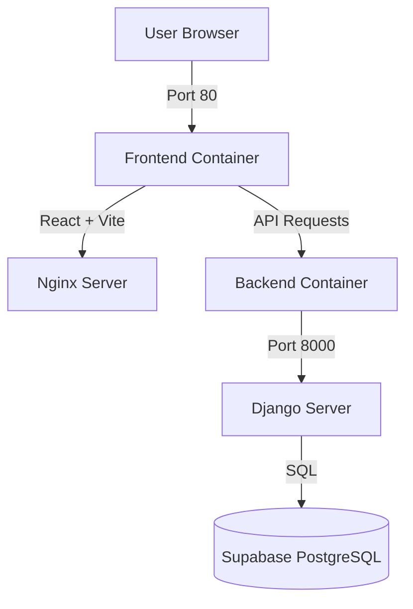

# Docker Implementation - Presentation

## Overview

We have successfully containerized the MediGuide application to ensure consistency across development and production environments. This implementation orchestrates the Django backend and React frontend using Docker Compose.

---

## Architecture



---

## 1. Backend Containerization

**Base Image**: `python:3.10-slim`

**Key Features**:
- **Optimized Build**: Uses slim image to reduce size.
- **Dependency Management**: Installs packages from `requirements.txt` (including the new `reportlab`).
- **Environment**: Configured with `PYTHONDONTWRITEBYTECODE` and `PYTHONUNBUFFERED` for better Docker performance.
- **Port**: Exposes port `8000`.

**Dockerfile Snippet**:
```dockerfile
FROM python:3.10-slim
WORKDIR /app
COPY requirements.txt /app/
RUN pip install -r requirements.txt
COPY . /app/
CMD ["python", "manage.py", "runserver", "0.0.0.0:8000"]
```

---

## 2. Frontend Containerization

**Base Image**: `node:20-alpine` (Build) -> `nginx:alpine` (Serve)

**Key Features**:
- **Multi-Stage Build**: 
  1. **Build Stage**: Compiles React/Vite app to static files.
  2. **Production Stage**: Serves static files using Nginx.
- **Performance**: Nginx provides high-performance static asset serving.
- **Configuration**: Custom `nginx.conf` to handle React Router (SPA) routing.

**Dockerfile Snippet**:
```dockerfile
# Stage 1: Build
FROM node:20-alpine as build
WORKDIR /app
COPY package*.json ./
RUN npm install
COPY . .
RUN npm run build

# Stage 2: Serve
FROM nginx:alpine
COPY --from=build /app/dist /usr/share/nginx/html
COPY nginx.conf /etc/nginx/conf.d/default.conf
EXPOSE 80
```

---

## 3. Orchestration (Docker Compose)

**File**: `docker-compose.yml`

**Services**:
1. **Backend**:
   - Maps port `8000:8000`
   - Mounts volume for hot-reloading during development
   - Loads environment variables from `.env`

2. **Frontend**:
   - Maps port `80:80`
   - Depends on backend service
   - Automatic restart policy

**Configuration**:
```yaml
services:
  backend:
    build: ./backend
    ports:
      - "8000:8000"
    volumes:
      - ./backend:/app
    
  frontend:
    build: ./frontend
    ports:
      - "80:80"
    depends_on:
      - backend
```

---

## 4. Key Challenges & Solutions

### Challenge 1: API URL Routing in Docker
**Issue**: The frontend needs to know the backend's URL. In Docker, `localhost` refers to the container itself, not the host machine.
**Solution**: 
- Configured `VITE_API_URL` environment variable.
- Implemented robust URL normalization in `reports.js` to handle path inconsistencies (e.g., preventing double `/api/api/` prefixes).

### Challenge 2: PDF Generation Dependencies
**Issue**: Generating PDFs requires specific system libraries.
**Solution**: 
- Added `reportlab` to backend dependencies.
- Rebuilt containers to ensure binary dependencies are correctly installed in the Linux environment.

---

## 5. How to Run

### Prerequisites
- Docker Desktop installed
- Git repository cloned

### Start Application
```bash
# Build and start services
docker-compose up --build
```

### Access Points
- **Frontend**: http://localhost (Port 80)
- **Backend API**: http://localhost:8000
- **Admin Panel**: http://localhost:8000/admin

### Stop Application
```bash
docker-compose down
```

---

## Benefits of This Implementation

1. **"Works on My Machine" Solved**: Identical environment for all developers.
2. **Simplified Deployment**: One command (`docker-compose up`) to start the entire stack.
3. **Isolation**: Dependencies are locked inside containers, not polluting the host OS.
4. **Scalability**: Services are decoupled and can be scaled independently.

---

**Project**: MediGuide  
**Component**: Containerization Infrastructure  
**Date**: December 3, 2025
